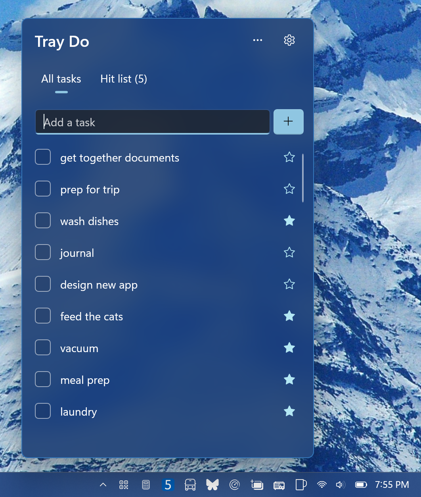

# Tray Do

A small to-do list that lives in the Windows notification area. Click the tray icon and your tasks
open in a flyout styled like the shell's own; click away and it's gone.



## Features

- **All tasks and a hit list.** Keep everything in *All tasks*, then star the few you'll do next
  to line them up on the *Hit list*. Taking a task off the hit list, or clearing it, never
  completes or deletes the task.
- **A count on the tray icon.** While the hit list has open tasks, the tray icon shows how many,
  so you can see what's left without opening anything.
- **Paste a list.** Paste several lines (a note, an email, a Markdown checklist) and each line
  becomes a task, with bullets, numbers and checkboxes stripped.
- **Stays out of the way.** No main window and no taskbar button. The flyout closes on its own
  after a minute hidden, so the idle app holds almost no memory.
- **Offline and private.** Tasks are saved only to `tasks.json` in the app's local data folder.
  The app has no network access.
- **Start with Windows**, from Settings in the flyout.

## Build and run

Requires Windows 11 (or Windows 10 1809+), the .NET 10 SDK, and Developer Mode turned on.

```powershell
$Platform = if ($env:PROCESSOR_ARCHITECTURE -eq 'AMD64') { 'x64' } else { $env:PROCESSOR_ARCHITECTURE }
dotnet run -c Debug -p:Platform=$Platform
```

`dotnet run` registers the app as a loose-layout MSIX package through the
[winapp CLI](https://github.com/microsoft/WinAppCli) and launches it with package identity.
Launching it again while it's running opens the flyout.

Run the tests with:

```powershell
dotnet test TrayDo.Tests
```

## Project layout

| Folder | What's in it |
|---|---|
| `Views/` | The tray flyout window, the tasks page and the settings page |
| `Services/` | Task storage, the tray badge, settings, start-with-Windows and window placement |
| `TrayDo.Core/` | Platform-free logic: the task board, the task file and badge drawing |
| `TrayDo.Tests/` | Unit tests for `TrayDo.Core` |

Built with WinUI 3 and the Windows App SDK.

## License

[MIT](LICENSE)
